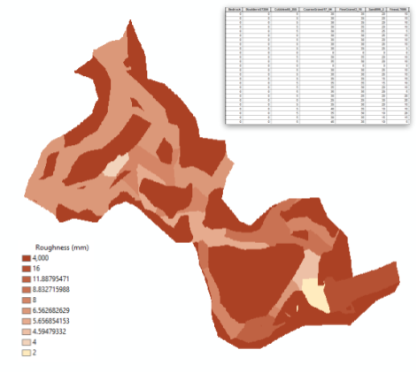

The substrate tool generates a stream-bed roughness raster of a specified grain size percentile of a grain size distribution curve based on ocular grain size estimates for each channel unit for a CHaMP topographic Survey.

# Usage

## Inputs

* Topo Survey must be processed and contain the following:
  * Channel Unit Polygons, Clipped to the Water Extent polygon
  * Bankfull Polygon
  * DEM
* Visit must have aux measurements of Channel Unit Ocular Grain Size estimate.

## Outputs

The following datasets are generated by this tool:

* `substrate_D<xx>.tif`  where <xx> is the d value calculated. A Geotiff raster dataset of substrate roughness over the surveyed area of the visit (DEM data extent). Substrate is calculated over each channel unit and spread to the bankfull extent. An out of channel substrate roughness is used for all other areas within the DEM data extent (default 4000mm).
* `substrate_D<xx>.shp` where <xx> is the d value calculated. A shapefile of the bankfull-extended channel unit areas used to generate substrate.tif.  
* `riverscapes.rs.xml` Riverscapes project file 

## Summery of Methods

1. Calculate grain size for each channel unit:
   1. Loop through each channel unit
   2. Add percentages of each grain size until at target percentile
   3. Calculate grain size using linear interpolation
2. Spread the channel unit polygons to the bankfull extent:
   1. Generate Voronoi polygons from edges of Channel Unit Polygons
   2. Assign channel unit ID's to Voronoi polygons
   3. Clip Voronoi polygons to bankfull extent. Make sure each clipped Voronoi polygon has a Channel unit ID, otherwise assign to nearest channel unit.
   4. Merge Voronoi with original Channel Unit Areas and dissolve to form expanded polygons.
3. Add the DEM Data Extent as "Out of Channel" area
4. Assign grain size values to each polygon.
5. Rasterize Polygons
6. Generate Riverscapes.rs.xml

## Syntax

Command Line parameters for `substrate_raster.py`:

* Positional Arguments
  * `visitID` (int) the visit id of the site to use (no spaces)
  * `outputfolder` (str) output folder for the substrate raster.
  * `output_substrate_value` (int) percentile of grain size to calculate. 50 for D50, 84 for D84, etc.
  * `out_channel_roughness_value` (float) out of channel roughness value (mm).
* Optional Arguments
  *  `occular_estimates` (str) local json file of ocular substrate estimates.
  *  `datafolder` (str) Top level folder containing Topo Project Riverscapes projects
  *  `verbose` (bool) Get more information in your logs.

# About

- **Code Repository** https://github.com/SouthForkResearch/CHaMP_Metrics
- **Software Architecture** Python 2.7 with standard library and the following 3rd-Party Dependencies:
  - substrate_raster
    - geopandas, pandas
    - shapely
    - osgeo
    - scipy
  - CHaMP_Metrics/Lib:
    - shapely
    - numpy
    - gdal, ogr, osr
- **Batch Processing** this script is designed to work with CHaMP_Automation on AWS or with `batch_run.py` tool
- Code written and maintained by Kelly Whitehead at South Fork Research.

# Release Notes

- `version 0.0.4` 2017-11-28
  - Method Change: Expand substrate value into channel units that are missing ocular estimates
  - Fixed Missing Spatial References  
- `version 0.0.3` 2017-11-21
  - Bug Fix: Invalid Features in Shapely
  - Better handling of missing substrate values
  - Better handling of missing topo project meta tags
- `version 0.0.2` 2017-11-20
  - Fixed minimum value for grain size calculator
  - Allow multiple d values per tool run
  - Generate Riverscapes Project File
- `version 0.0.1`  2017-10-31
  - Initial test version

[TOOL HOME](index.md)
